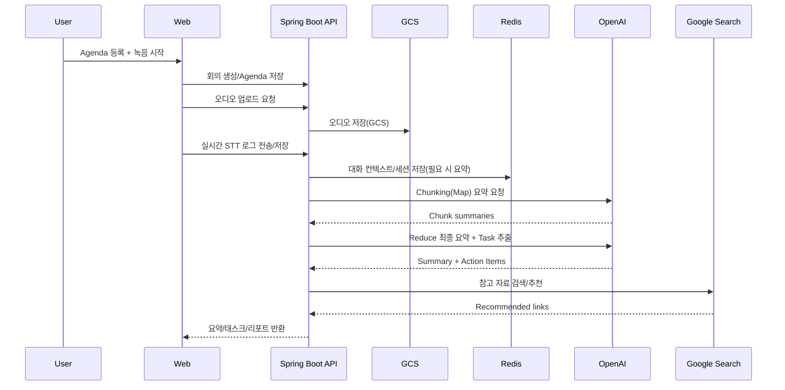

# DotDot_BE
**DotDot**은 회의의 기록–정리–공유 전 과정을 자동화해, 팀이 회의의 본질인 소통과 의사결정에만 집중할 수 있도록 돕는 **AI 회의 어시스턴트 플랫폼**입니다.
- **STT(Speech-to-Text)** 변환으로 회의 내용을 누락 없이 기록
- 회의 흐름을 반영한 **핵심 요약** 및 **담당자별 태스크 자동 추출**
- 안건 기반 **맥락형 챗봇**으로 회의 중 즉시 질의응답
- **팀 워크스페이스**로 회의록/팀원/진행 상황을 한 곳에서 관리
- 회의 결과 **PDF 저장 및 이메일 자동 발송**, **회의 기반 참고 자료 추천**

> **개발 기간**: 2025.07.19 ~ 2025.10.28

</br>


</br>
</br>

## 🧑‍💻👩‍💻 팀원 소개
|  |  | |  |
|:---:|:---:|:---:|:---:|
| **고예린** | **김다은** | **김세현** | **정태윤** |
| [@nenini](https://github.com/nenini) | [@daeun088](https://github.com/daeun088) |[@kkshyun](https://github.com/kkshyun) | [@turden1](https://github.com/turden1) |

</br>

## ⚙️ 주요 기능

### 1. 인증 & 사용자 관리
* **JWT 기반 보안**: Access/Refresh 토큰 기반 인증·인가 및 토큰 수명 관리
* **비밀번호 재설정**: 이메일 링크 기반 비밀번호 변경 플로우
* **GCS 연동**: Google Cloud Storage 기반 프로필 이미지·회의 오디오 파일 저장/관리
* **Redis 컨텍스트 관리**: 챗봇 대화 히스토리 요약·보관 및 Refresh 토큰 관리

### 2. 회의 & 팀 워크스페이스
* **팀 기반 관리**: 팀 생성, 멤버 초대, 역할·권한 관리, 독립 워크스페이스 구성
* **회의 워크플로우**: Agenda 등록 → 녹음 → 실시간 STT 로그 저장 → 요약/태스크 생성까지의 end-to-end 프로세스
* **스피치 로그**: 발화자 인덱스 기반 텍스트·타임라인 구조화, 정교한 회의록 생성

### 3. AI 분석 및 자동화
* **회의 요약**: OpenAI GPT 기반 핵심 요약·리포트 생성
* **태스크 자동 할당**: 담당자·기한·우선순위 포함 Action Items 자동 추출
* **지능형 챗봇**: Agenda + 요약 + 대화 히스토리 기반 맥락형 Q&A
* **자료 추천**: Google Search API 기반 주제 연관 참고 자료 자동 큐레이션
* **이메일 전송**: 회의록/요약/태스크/리포트의 이메일 자동 발송 및 공유

### 4. 사후 관리 및 리포팅
* **진행 상황 트래킹**: Task 상태(TODO, DONE 등) 관리 및 캘린더 연동
* **북마크 기능**: 회의 중 중요 구간 저장 및 빠른 재탐색
* **녹음 다시 듣기**: 저장된 회의 오디오 재생을 통한 회의 복기 및 검증

</br>

## 🛠 기술 스택

### Backend
<p>


</p>

### Database & Infra
<p>


</p>

### API
<p>


</p>

### Collaboration & Project Management
<p>


</p>

</br>

## 🗄️ ERD


</br>

## 📂 프로젝트 구조

```plaintext
src/main/java/com/example/dotdot
├── config/                 # GCS, OpenAI, Redis, Security 등 인프라 설정
├── controller/             # REST 컨트롤러 및 API 명세(Specification)
├── domain/                 # JPA 엔티티 및 도메인 모델 (Meeting, User, Team 등)
│   └── task/               # Task 전용 엔티티 및 Enum (Status, Priority)
├── dto/                    # 데이터 전송 객체 (Request/Response 분리)
├── global/                 # 공통 처리 모듈
│   ├── client/             # 외부 API 통신 (OpenAI, Google Search)
│   ├── exception/          # 도메인별 세분화된 커스텀 예외 및 핸들러
│   └── security/           # JWT 필터 및 인증 메커니즘
├── repository/             # Spring Data JPA 리포지토리
└── service/                # 비즈니스 로직 처리
```
</br>

## 📎 Software Architecture

## 📄 Meeting Analysis Flow


## 🌐 Deployment & Infrastructure
본 프로젝트는 **AWS** 환경에서 안정적으로 운영되었으며, 보안과 확장성을 고려하여 구축되었습니다.

**Infrastructure**: AWS EC2 (Ubuntu 22.04 LTS), 탄력적 IP(Elastic IP) 적용

**Web Server**: Nginx 리버스 프록시 및 Certbot(Let's Encrypt)을 통한 HTTPS(SSL) 적용

**Deployment**: Shell Script(deploy.sh)를 이용한 수동 배포 및 프로세스 관리

**Monitoring**: logrotate를 활용한 일 단위 로그 압축 및 보관(7일 보존)

**Security**: 환경 변수 기반 비밀 정보 관리 및 인바운드 보안 그룹 최적화 (22, 80, 443 포트)

**Optimizing**: Nginx 및 애플리케이션 설정을 통한 대용량 파일(10MB) 업로드 최적화

</br>

## 📑 Trouble Shooting

#### 1) 장시간 회의 처리 시 타임아웃 문제
- **문제 (Problem)**: 30분 이상 장시간 회의 처리 시 단일 API 호출 방식 한계로 게이트웨이 타임아웃 빈발
- **원인 분석 (Analysis)**: OpenAI API 응답 지연 + 서버 동기 처리 충돌로 입력 텍스트 증가에 따른 응답 실패 확률 상승
- **해결 방법 (Solution)**
  - **청킹(Chunking) 전략 적용**: 전체 텍스트 12,000자 단위(CHUNK_SIZE) 분할 + 흐름 유지를 위한 500자 중첩(CHUNK_OVERLAP) 구성
  - **Map-Reduce 파이프라인 구축**: 조각 단위 요약(Map) 수행 후 최종 요약(Reduce) 결합하는 2단계 처리
- **결과 (Result)**: 2시간 이상 회의 데이터의 안정적 처리 가능

---

#### 2) LLM 토큰 한계 및 할루시네이션 문제
- **문제 (Problem)**: 긴 회의록 입력 시 토큰 한계 초과 및 중요도 낮은 대화 중심 요약으로 핵심 흐림 발생
- **원인 분석 (Analysis)**: 원문 전체 단순 주입 시 사전 정의된 안건과 잡담 간 우선순위 구분 불명확
- **해결 방법 (Solution)**
  - **안건 기반 프롬프트 튜닝**: 사전 등록된 회의 안건(Agenda) 강제 주입을 통한 분석 기준점 고정 및 할루시네이션 최소화
  - **정제(Clean Summary) 단계 분리**: 요약 결과에서 노이즈 제거 및 순수 요약문 추출을 위한 전용 로직(`extractCleanSummary`) 추가
- **결과 (Result)**: 안건 일치율 향상 및 실행 가능한 태스크(Action Items) 추출 정확도 확보

---

#### 3) 챗봇 대화 맥락 단절 문제
- **문제 (Problem)**: 이전 Q&A 미반영 및 회의 흐름과 동떨어진 답변 생성
- **원인 분석 (Analysis)**: 대화 세션 독립 처리로 이전 질의/응답 상태(Memory) 관리 부재
- **해결 방법 (Solution)**
  - **다층 컨텍스트 주입 구조 설계**: **[회의 안건 + 요약본 + 대화 히스토리]** 결합을 통한 시스템 프롬프트 구성
  - **Redis 기반 세션 관리**: 실시간 대화 로그 저장 및 대화 길이 증가 시 자동 요약을 통한 토큰 소모 최적화
- **결과 (Result)**: 이전 대화와 자연스럽게 이어지는 맥락 일관형 답변 제공 가능

</br>

## 📑 API


